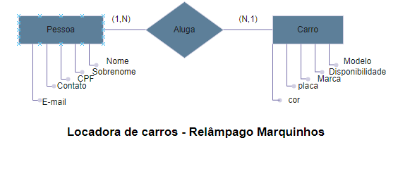
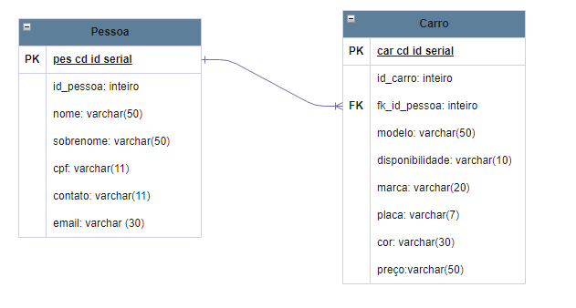

<!DOCTYPE html>
<html>

<head>
  <title>Banco de Dados Individual</title>
</head>

<body>
  <h1 align="center">Trabalho de bancos individual</h1>

  <h2>Descrição do Projeto</h2>
  
Este trabalho é um projeto de banco de dados voltado para o relacionamento entre pessoa e carro, tendo como base um cenário de aluguel de carros conforme o contexto a seguir:

  
<strong>Agência de Alugueis de Carros Relâmpago Marquinhos</strong>

  
<strong>Pessoa:</strong> A agência de alugueis, Relâmpago Marquinhos, mantém internamente um registro de clientes que desejam ou já alugaram alguns de seus mais variados veículos. Cada pessoa é um cliente único, que por sua vez tem interesse em uma determinada experiência automobilística. Para realizar o cadastro, o sistema solicita alguns dados do cliente, como nome, sobrenome, CPF, número para contato e uma segunda alternativa de contato, que é o email.

  
<strong>Carro:</strong> Os veículos disponíveis para aluguel vão desde carros de luxo a carros esportivos, e são selecionados para qualquer experiência que o cliente deseje ter. Os carros, assim como os clientes, também possuem suas características, como número de identificação, modelo, marca, o custo do aluguel e se estão disponíveis para aluguel ou não.

  
Nesse caso, o relacionamento entre pessoa e carro é a base da estrutura para que toda a operação geral da locadora possa ocorrer. Cada pessoa pode alugar um ou mais carros, conforme a necessidade da experiência que ela deseja ter. Da mesma forma, os carros podem ter pertencido a mais de um cliente, conforme consta nos registros.

  <h2>Modelo Conceitual</h2>
  

  <h2>Modelo Lógico</h2>
  
</body>

</html>

